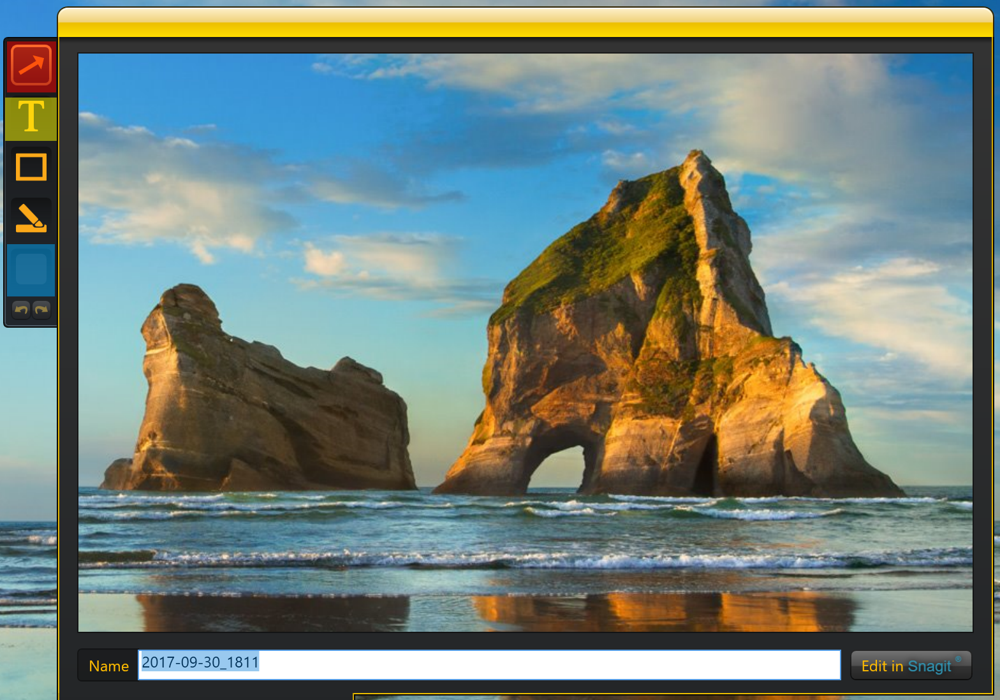
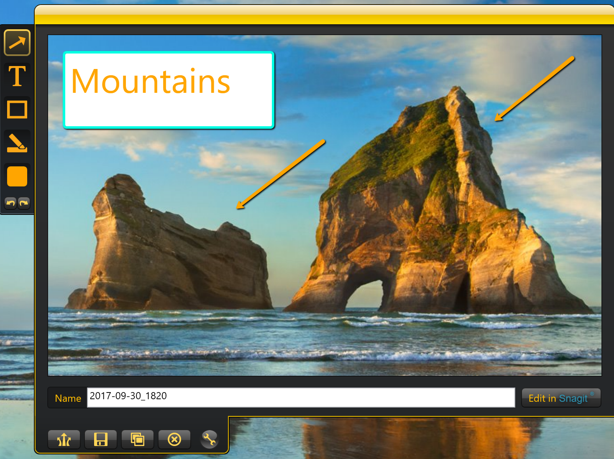

# How to annotate an image capture

*After [taking an image capture](How to take an image capture.md), you may wish to edit the image to highlight and clarify aspects of it. Jing has this capability built-in.*
**To do so:**

## How to make an arrow annotation
1. Click the **Arrow** Icon in the lefthand toolbar indicated in red
1. Click and drag *toward* the part of the image you want the arrow to point towards.
1. Ajust the opacity and color of the arrow by clicking the **Color** icon indicated in blue

## How to make text annotation
1. Click the **Text** icon indicated in yellow in the lefthand toolbar.
1. Click and drag a textbox over the area of the image you want to overlay text onto.
1. Click inside the textbox and type the text.
1. Adjust the opacity and color of the text by hovering over and using the color tool that appears. 
1. Adjust the opacity and color of the textbook frame by clicking the **color** icon indicated in blue. 