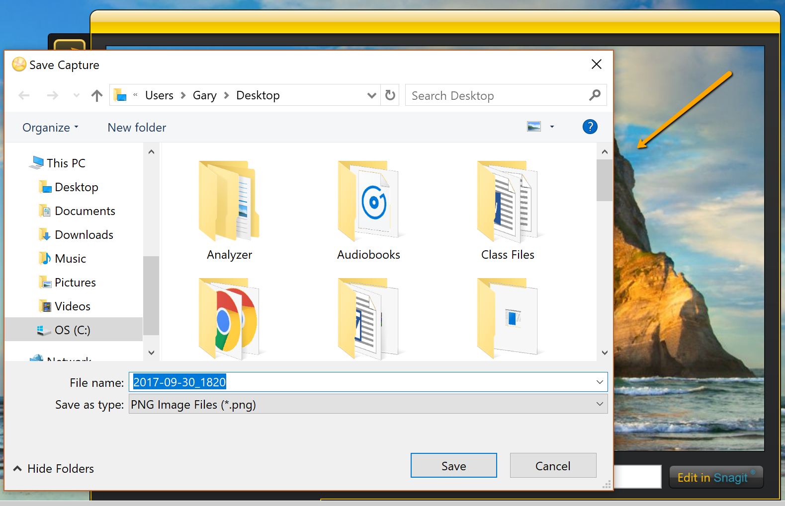

# How to save an annotated image

*After you have [annonated and edited the image](How to annotate an image capture.md) to serve your purpose, you can then save the image for future use and posterity.*
**To do so:**
1. From the annotation window, click the **Save** icon in the bottom toolbar. 
1. The file explorer will appear. Choose a location on your computer to save the annotated image. 
1. You can also change the name of the annotated image. By default, Jing will use the time and date the image capture was taken as the file name.
1. Click the **Save** button. 