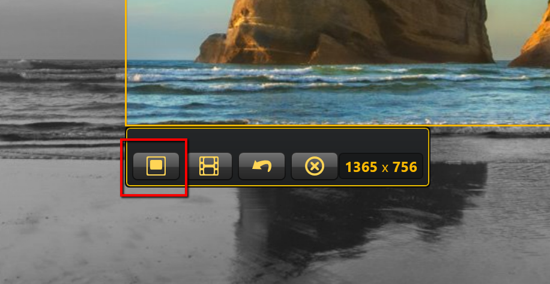

# How to take a image capture

*After [triggering screen capture](How to trigger a screen capture.md), crosshairs will appear on your screen. You use these crosshairs to select the area of the screen you want to capture in an image.*
**To do so:**

1. Click and drag your cursor until the area you want to capture selected inside the colored box.
2. Release the cursor to capture the area. A new window will appear showing you the image you have just captured. Selecting an area as done in step 1 will give you the image below. 
3. If you are satisfied with the image, click the **Image Capture** icon in the tool bar, indicated in the red box.
4. If you are dissatisfied with the image, click the **Redo Selection** icon in the tool bar, indicated in the blue box. 