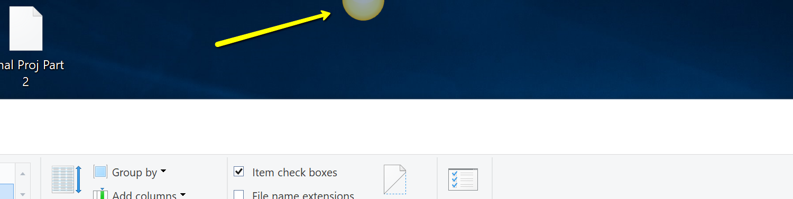
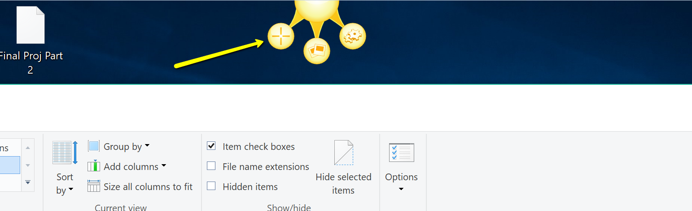

# How to trigger a screen capture

*Triggering a screen capture is the first step of any Jing process whether you are capturing video or a still image.*

**To do so:**

1.	Hover your cursor over the Jing Icon indicated by the yellow arrow. In the example image, the Jing icon is docked on the top of the screen but your icon may be docked on the sides or bottom of your screen. 
2.  While the cursor is hoving over the Jing icon, three new circular icons will expand from it. Click the **+** icon indicated by the yellow arrow. This will trigger the screen capture

*Note: You can dock the Jing icon in any side of the screen you want by clicking and dragging it there*